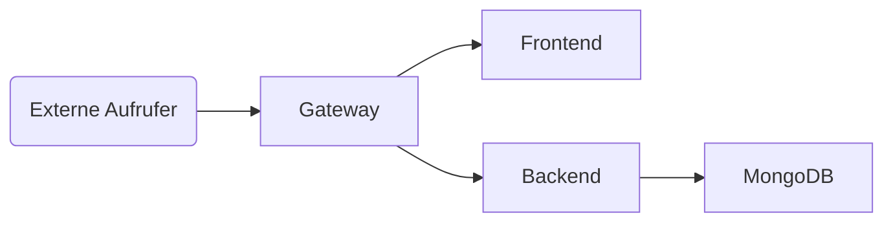

Beispielanwendung „Adressbuch”
==============================

Inhaltsverzeichnis
------------------

 1. [Kurzbeschreibung](#kurzbeschreibung)
 1. [Start mit Docker Compose](#start-mit-docker-compose)
 1. [Start einzelner Services mit und ohne Docker](#start-einzelner-services-mit-und-ohne-docker)
 1. [Hinwes zu Podman unter Linux](#hinweis-zu-podman-unter-linux)

Kurzbeschreibung
----------------
Bei dieser Anwendung handelt es sich um eine Weiterentwicklung der gleichnamigen
Aufgabe aus der Vorlesung „Webprogrammierung” im 3. Semester. Auch hier wird
eine einfache Single Page App zur Verwaltung simpler Adressdatensätze implementiert.

Diese Version beinhaltet jedoch neben der Benutzeroberfläche auch ein vollständiges
REST-Backend zur Ablage der Adressen in einer zentralen Datenbank und auch die
Struktur des Quellcodes folgt eher modernen Best Practices wie der Nutzung von
npm zur Verwaltung von Abhängigkeiten und der Nutzung eines Bundlers, um diese
dem Browser zugänglich zu machen.

Mit Docker und Docker Compose können die Bestandteile der App einzeln oder
als Gesamtprojekt ausgeführt werden.


Start mit Docker Compose
------------------------

Das Wurzelverzeichnis beinhaltet zwei Docker Compose Files, mit denen die
Anwendung im Entwicklungs- oder Produktivmodus gestartet werden kann:

 * `docker-compose.dev.yml`: Entwicklungsmodus mit folgenden Diensten:

     1. MongoDB (von Außen nicht erreichbar)
     2. MongoDB Admin GUI (erreichbar auf http://localhost:8081)
     3. Backend (erreichbar auf http://localhost:3000)
     4. Frontend (erreichbar auf http://localhost:8080)

 Frontend und Backend führend den lokalen Quellcode in einer einfachen
 Node.js-Laufzeitumgebung aus. Änderungen werden dadurch sofort aktiv, wobei
 sich das Backend bei einer Änderung automatisch neustartet und bei einer
 Änderung am Frontend einfach nur die Seite im Browser neugeladen werden
 muss.

 * `docker-compose.prod.yml`: Produktivmodus mit folgenden Diensten:

     1. MongoDB (von Außen nicht erreichbar)
     2. Backend (von Außen nicht erreichbar)
     3. Frontend (von Außen nicht erreichbar)
     4. Gateway (erreichbar auf http://localhost:8080)

Im Unterschied zum Entwicklungsmodus werden hier anhand der in den jeweiligen
Verzeichnissen abgelegten Datei `Dockerfile` eigenständige Container Images
für Frontend und Backend gebaut und ausgeführt. Der Quellcode wird hierfür
einmalig in die Images hinein kopiert, so dass Änderungen daran erst wirksam
werden, wenn die Images neu erstellt werden. Dies kann entweder in den
jeweiligen Verzeichnissen manuell oder durch Neustarten von Docker Compose
erreicht werden.

Ebenso sind die meisten Services in dieser Version von Außen nicht mehr
erreichbar, sondern hinter einem Gateway-Server versteckt. Die Architektur
sieht somit in etwa so aus:



Das Vorgehen zum Starten und Stoppen der Anwendung ist für beide Modus gleich.
Lediglich der Dateiname muss in den folgenden Befehlen angepasst werden:

 * `docker-compose -f docker-compose.dev.yml up -d` zum Starten aller Dienste
 * `docker-compose -f docker-compose.dev.yml down` zum Stoppen aller Dienste
 * `docker system prune` zum Aufräumen nicht mehr benötigter Dateien

Im Falle der Produktivversion werden die Container für Frontend und Backend von
Docker Compose nur einmalig gebaut, dann aber nicht mehr erneut gebaut, wenn
sich der zugrunde liegende Quellcode verändert. Vor der nächsten Ausführung
müssen sie daher bei einer Änderung mit folgendem Befehl erneut gebaut werden:

```sh
docker-compose -f docker-compose.prod.yml build
```

In der Produktivversion kann durch Setzen der Umgebungsvariable API_URL die
Adresse des Backendservices definiert werden, mit der sich das Frontend zu
verbinden versucht:

```sh
export API_URL=http://api.beispiel.de
docker-compose -f docker-compose.prod.yml up -d
```

Dies Funktioniert, indem die Umgebungsvariable in der `docker-compose.prod.yml`
an die gleichnamige Umgebungsvariable des Frontend-Containers übergeben und
bei dessen Start durch ein Startskript ausgewertet wird. Das Skript schreibt
den Inhalt in eine statische Datei, die das Frontend unter der Addresse
`api.url` abrufen kann. Der Mechanismus ist im Grunde genommen derselbe, wie
Docker ihn für "Secrets" und "Configs" bereitstellt. Auch diese werden einfach
über eine Datei im Container sichtar gemacht. Leider bietet Docker diese
Funktion aber nur in Zusammenhang mit Docker Swarm an. Zwar lässt sich die
App unverändert auch mit Docker Swarm ausführen, dies wird hier allerdings
absichtlicht nicht beschrieben, da es auf Docker Compose aufbaut und Docker
Compose davon abgesehen für uns zunächst ausreicht.

Start einzelner Services mit und ohne Docker
--------------------------------------------

Die README-Dateien in den jeweiligen Unterverzeichnissen beschrieben, wie die
einzelnen Services mit und ohne Docker jeweils einzeln ausgeführt werden können,
um diese in Isolation zu testen. In der Regel ist jedoch einfacher, mit Docker
Compose eine komplette Entwicklungsumgebung zu starten und darauf los zu
programmieren.

Hinweis zu Podman unter Linux
-----------------------------

Unter Linux hat sich inzwischen Podman als verbreitete Alternative zu Docker
durchgesetzt, u.a. weil es ohne Root-Rechte und einen im Hintergrund laufenden
Daemon-Prozess auskommt. Alle in diesem Projekt gezeigte Befehle funktionieren
nahezu unverändert auch mit Podman. Es muss lediglich `docker` durch `podman`
bzw. `docker-compose` durch `podman-compose` ersetzt werden.
